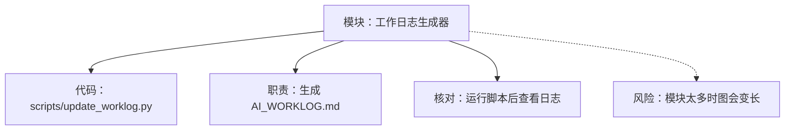

# Code CCTV

定位你的ai编程。

`Code CCTV` 是一个 Codex 本地插件，用中文 `AI_WORKLOG.md` 把 AI 辅助编程过程展开给人看。它适合在你看不懂 AI 正在改什么、为什么这么改、改动到底落在哪些函数和代码段时使用。

名字里的 `CCTV` 是玩笑版“代码监控摄像头”：不是偷偷监视人，而是让 AI 别把处理屎山代码的过程藏起来。

## 它解决什么

- AI 辅助编程时，用户只能看聊天记录，很难定位真实改动。
- 编程小白不知道每个函数、每段代码到底负责什么。
- AI 说“已修复”但缺少证据、命令、文件和核对方式。
- 老项目或屎山代码里，改动路径容易绕，事后很难复盘。

## 输出效果

启用后，Codex 会在当前项目根目录维护 `AI_WORKLOG.md`，默认使用中文模板，包含：

- 信息金字塔：最重要结论、风险、阻塞和下一步放在最前面
- 模块图谱：每个代码模块都有表格说明和 Mermaid 图节点
- 实时进度和 Mermaid 流程图
- 正在查看、编辑、验证的文件
- 函数定位：文件、行号、函数名、函数作用、怎么核对
- 代码片段说明：这段代码在做什么、初学者该看哪里
- 决策记录：为什么这样改，有什么取舍
- 验证结果：运行了什么命令，结果是什么
- 初学者核对清单：按步骤检查，不靠猜
- 风险与最终总结：还需要注意什么

`AI_WORKLOG.md` 不是后台偷偷采集的遥测，而是 Codex 在工作时主动维护的可读工作日志。它的目标是让你能顺着文件、函数和命令把 AI 的操作查回去。

## 自动更新模式

你要的“边写代码边看流程”主要靠两层实现：

- 技能启用后：只要有用户互动、代码输出、工具命令、文件编辑、验证结果或阻塞信息，Codex 都应该更新 `AI_WORKLOG.md`。
- 可选文件监听器：`watch_worklog.py` 会监听工作区文件的新增、修改、删除，并自动把变化写进 `AI_WORKLOG.md`。

开启文件监听器：

```bash
python3 ~/plugins/code-cctv/scripts/watch_worklog.py --workspace "$PWD"
```

只检查一次文件变化：

```bash
python3 ~/plugins/code-cctv/scripts/watch_worklog.py --workspace "$PWD" --once
```

建议写代码时同时打开 `AI_WORKLOG.md` 预览。Codex 负责记录交互和代码输出，监听器负责补充磁盘文件变化。

## 信息金字塔和模块图

新版日志默认按“金字塔”看：

- `P0 先看结论`：当前最重要的结果、风险、阻塞或下一步。
- `P1 再看模块`：本次涉及哪些模块，每个模块负责什么、依赖什么、有什么风险。
- `P2 最后查细节`：实时记录、函数定位、代码段说明、验证命令和最终总结。

模块图谱使用 Markdown 内置的 Mermaid：



每个模块都应该写清楚：

- `相关代码`：文件、函数或行号。
- `职责`：这个模块到底负责什么。
- `依赖`：它依赖哪个模块、配置、脚本或外部工具。
- `风险`：改错后最可能影响哪里。
- `怎么核对`：编程小白也能照着检查的步骤。

## 安装

把仓库放到本机插件目录：

```bash
mkdir -p ~/plugins
git clone https://github.com/cyc120/code-cctv.git ~/plugins/code-cctv
```

如果你还没有个人插件市场，可以创建或编辑 `~/.agents/plugins/marketplace.json`，在 `plugins` 数组里加入：

```json
{
  "name": "code-cctv",
  "source": {
    "source": "local",
    "path": "./plugins/code-cctv"
  },
  "policy": {
    "installation": "AVAILABLE",
    "authentication": "ON_INSTALL"
  },
  "category": "Productivity"
}
```

一个最小完整示例：

```json
{
  "name": "personal",
  "interface": {
    "displayName": "Personal"
  },
  "plugins": [
    {
      "name": "code-cctv",
      "source": {
        "source": "local",
        "path": "./plugins/code-cctv"
      },
      "policy": {
        "installation": "AVAILABLE",
        "authentication": "ON_INSTALL"
      },
      "category": "Productivity"
    }
  ]
}
```

然后安装插件：

```bash
codex plugin add code-cctv@personal
```

更新本地插件后，可以重新安装一次，让 Codex 读取最新版本：

```bash
codex plugin add code-cctv@personal
```

## 使用

新开 Codex 线程后，可以直接这样说：

```text
使用 $code-cctv，开启自动更新模式。只要有交互、代码输出、工具命令、文件编辑或验证结果，就更新 AI_WORKLOG.md。
```

按信息金字塔和模块图展示：

```text
使用 $code-cctv，按信息金字塔展示本次修改，并给每个代码模块生成 Mermaid 模块图。只要有交互或代码产出，就自动更新 AI_WORKLOG.md。
```

也可以更具体：

```text
使用 $code-cctv，帮我修这个 bug。请在 AI_WORKLOG.md 里定位每个相关函数，说明每段关键代码在干嘛，并给我小白也能照着检查的核对清单。
```

## 脚本

插件内置三个辅助脚本，Codex 可以在需要时调用。

更新工作日志：

```bash
python3 scripts/update_worklog.py --workspace "$PWD" --language zh --status "侦察中" --focus "正在阅读项目上下文" \
  --top "P0 先看结论|正在定位问题入口|先看信息金字塔判断是否阻塞" \
  --module "入口模块|src/app.py:1-80|接收请求并分发到业务逻辑|暂无|路由改错会影响页面访问|打开 src/app.py，确认入口函数和路由是否匹配"
```

扫描 Python/JavaScript/TypeScript 函数位置：

```bash
python3 scripts/scan_code_map.py src tests
```

监听文件变化并更新工作日志：

```bash
python3 scripts/watch_worklog.py --workspace "$PWD"
```

扫描脚本只生成行号骨架。真正给初学者看的解释，应该由 Codex 结合上下文补全。

## 初学者怎么看

打开项目里的 `AI_WORKLOG.md`，优先看这几块：

- `信息金字塔`：先看结论、风险和下一步。
- `模块图谱`：看每个模块负责什么，和哪些文件、风险、核对方式相连。
- `流程图`：看 AI 当前走到哪一步。
- `实时记录`：看每次行动、证据和命令。
- `函数定位`：按文件和行号跳到代码里，确认函数是不是它说的那个作用。
- `代码片段说明`：理解关键代码段为什么要改。
- `验证结果`：确认测试、构建或检查命令是否跑过。
- `初学者核对清单`：照着一步步检查结果。

## 适用场景

- 让 AI 修改陌生项目或遗留项目。
- 你想知道 AI 每一步到底做了什么。
- 你需要向别人解释本次改动的证据链。
- 你是编程新手，希望把函数、代码段和验证步骤看清楚。

## 当前限制

- 它不是全局后台聊天监听器；需要在任务中启用 `$code-cctv`，由 Codex 按交互和代码输出维护日志。
- `watch_worklog.py` 监听的是文件变化，不读取聊天消息。
- 函数扫描目前主要覆盖 Python、JavaScript、TypeScript 的常见函数形态。
- 扫描结果只是定位骨架，真正准确的解释仍需要 Codex 结合项目上下文补全。
