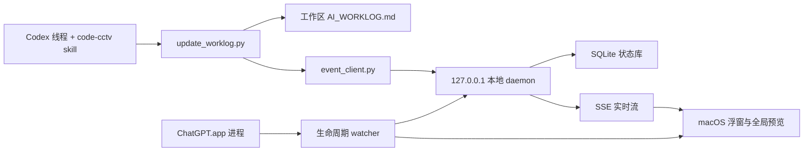

# Code CCTV

定位你的 AI 编程。

Code CCTV 是一个 Codex 本地插件：它把 AI 辅助编程过程整理成中文 `AI_WORKLOG.md`，让你能看见当前改了什么、为什么改、落在哪些模块，以及如何验证结果。macOS 上还可以启用可选的本地后台服务和浮窗，把多个工作区的结构化状态汇总到一个全局预览中。

## 适合谁

- 想看懂 AI 正在修改什么，而不是只看一句“已完成”。
- 正在处理陌生项目、遗留项目或复杂代码，想快速建立模块地图。
- 需要把函数位置、关键代码段、命令证据和验证步骤留档。
- 希望在 macOS 桌面上实时查看多个工作区的摘要。

## 核心能力

### 1. 中文工作日志

启用 `$code-cctv` 后，Codex 会在当前工作区根目录维护 `AI_WORKLOG.md`，默认按信息金字塔组织内容：

1. 先看结论、风险、阻塞和下一步。
2. 再看模块图谱和 Mermaid 关系图。
3. 最后查看实时记录、涉及文件、函数定位、代码片段说明、决策、验证和初学者核对清单。

日志是 Codex 在任务中主动维护的可读记录，不是偷偷采集的聊天遥测。

### 2. 文件变化监听

`watch_worklog.py` 可以监听工作区文件的新增、修改和删除，并把变化摘要追加到 `AI_WORKLOG.md`。它不读取聊天内容；用户互动、代码输出、工具结果和验证结果仍由 Codex 按 skill 规范主动记录。

### 3. macOS 实时状态服务

可选的后台服务只绑定 `127.0.0.1`，接收结构化摘要事件，并保存到本机 SQLite：

```text
~/Library/Application Support/CodeCCTV/state.sqlite3
```

浮窗通过 SSE 订阅实时状态，点击后可进入全局预览。服务记录工作区、阶段、状态、焦点、摘要、证据、文件列表和时间，不记录原始聊天全文，也不会主动向网络上传内容。

### 4. ChatGPT 生命周期跟随

运行 `manage_service.py install` 后会安装一个无界面的生命周期 watcher：

- watcher 在用户登录后负责检查 ChatGPT 是否运行，但不会自己显示浮窗。
- 检测到 `/Applications/ChatGPT.app` 运行时，才启动 daemon 和浮窗。
- ChatGPT 退出后，daemon 和浮窗自动停止。
- 它跟随的是 ChatGPT.app 进程存活状态，不是某个会话是否正在生成，因为目前没有稳定的公开会话状态 hook。
- 从 Codex 卸载插件后，watcher 检测到插件缓存消失，等待 15 秒确认不是重装切换，再停止子服务并清理自己的 LaunchAgent。

### 5. 浮窗交互

浮窗默认显示为可拖动胶囊，并提供以下入口：

- 单击：展开消息泡泡，显示最近项目、阶段、焦点和摘要。
- 双击：打开全局预览窗口。
- 拖动：移动浮窗，位置会保存到当前用户的偏好设置。
- 泡泡中的 `×`：关闭当前消息泡泡。
- 泡泡中的收起按钮：回到胶囊状态。
- 泡泡中的隐藏按钮：隐藏浮窗，但保留菜单栏入口。
- 右键：打开全局预览、显示/收起泡泡或隐藏浮窗。
- 菜单栏图标：重新显示浮窗、打开全局预览或退出 Code CCTV。

不要在已经安装常驻服务时再次运行 `scripts/run_macos_app.sh`，否则手动启动的 app 和 LaunchAgent 启动的浮窗可能同时出现。

## 工作流



## 安装插件

### 从 GitHub 克隆

```bash
mkdir -p ~/plugins
git clone git@github.com:cyc120/code-cctv.git ~/plugins/code-cctv
```

如果已经存在同名目录，使用：

```bash
git -C ~/plugins/code-cctv pull --ff-only
```

确保个人插件市场的 `code-cctv` 条目指向这份本地目录，然后安装或刷新插件：

```bash
codex plugin add code-cctv@personal
```

更新插件代码后，需要重新执行一次上面的命令；刷新后建议新开一个 Codex 线程，让新版本 skill 完整生效。

### 第一次使用

在新的 Codex 线程中输入：

```text
使用 $code-cctv，开启中文实时工作日志。请按信息金字塔展示结论，生成模块 Mermaid 图，标注函数和代码段位置，并给出初学者核对清单。
```

日志会写入当前项目根目录，而不是写入插件目录。

## 启用 macOS 常驻服务

macOS 浮窗构建脚本当前面向 Apple Silicon、macOS 13+：

```bash
cd ~/plugins/code-cctv
python3 scripts/manage_service.py install
python3 scripts/manage_service.py status
```

`install` 会在需要时构建 `dist/CodeCCTV.app`，并安装三个用户级 LaunchAgent：

```text
com.code-cctv.lifecycle   ChatGPT 生命周期 watcher
com.code-cctv.daemon      本地 HTTP/SSE 服务
com.code-cctv.floating    菜单栏图标与浮窗
```

常用命令：

```bash
python3 scripts/manage_service.py status   # 查看 ChatGPT、watcher、daemon、浮窗状态
python3 scripts/manage_service.py sync     # 立即按 ChatGPT 当前状态同步子服务
python3 scripts/manage_service.py stop     # 停止 watcher 和子服务，但保留 LaunchAgent 文件
python3 scripts/manage_service.py start    # 恢复跟随模式
python3 scripts/manage_service.py uninstall # 停止并删除 LaunchAgent
```

卸载服务不会删除本地状态库；如需清理历史摘要，可手动删除：

```text
~/Library/Application Support/CodeCCTV/
```

### 不需要常驻服务时

只使用 `AI_WORKLOG.md` 不需要安装 macOS 服务。也可以手动监听文件变化：

```bash
python3 scripts/watch_worklog.py --workspace "$PWD"
```

单次检查：

```bash
python3 scripts/watch_worklog.py --workspace "$PWD" --once
```

手动打开浮窗仅用于临时调试：

```bash
scripts/run_macos_app.sh
```

它不会替代 ChatGPT 生命周期模式；若已安装常驻服务，请先退出手动启动的 app，避免出现两个浮窗入口。

## 本地服务 API

配置文件和令牌位于：

```text
~/Library/Application Support/CodeCCTV/service.json
```

除 `/health` 外，接口都要求请求头 `X-Code-CCTV-Token`。接口只应在本机使用：

| 方法 | 路径 | 用途 |
| --- | --- | --- |
| GET | `/health` | 检查服务是否存活 |
| GET | `/api/state` | 获取全部工作区的当前摘要 |
| GET | `/api/stream` | 通过 SSE 订阅状态更新 |
| POST | `/api/events` | 写入一条结构化工作事件 |

工作日志更新器会尽力上报事件；daemon 不可用时，Markdown 写入仍会继续，不会因为浮窗服务故障而阻塞编程任务。

## 目录结构

| 路径 | 作用 |
| --- | --- |
| `.codex-plugin/plugin.json` | 插件名称、版本、技能入口和界面元数据 |
| `skills/code-cctv/SKILL.md` | 中文工作日志、模块图谱和验证规范 |
| `skills/code-cctv/assets/` | skill 使用的图标与中文日志模板 |
| `scripts/update_worklog.py` | 生成和更新 `AI_WORKLOG.md` |
| `scripts/watch_worklog.py` | 监听工作区文件变化 |
| `scripts/event_client.py` | 向本机 daemon 上报摘要事件 |
| `scripts/manage_service.py` | 安装、同步、停止和卸载 macOS 服务 |
| `scripts/chatgpt_lifecycle.py` | 检查 ChatGPT 进程并负责卸载后的自清理 |
| `daemon/` | 本地 HTTP、SSE 和 SQLite 状态服务 |
| `macos/` | Swift 菜单栏图标、浮窗和全局预览 |
| `tests/` | Python 脚本和 daemon 单元测试 |

## 常用脚本

按文件扩展名生成函数定位骨架：

```bash
python3 scripts/scan_code_map.py src tests
```

更新日志时也可以显式写入模块、函数和验证信息：

```bash
python3 scripts/update_worklog.py \
  --workspace "$PWD" \
  --language zh \
  --status "修改中" \
  --focus "正在处理登录模块" \
  --module "登录模块|src/auth.py:1-120|处理登录输入和校验|配置模块|边界条件可能漏测|运行登录测试并尝试错误密码" \
  --function "src/auth.py:42|login|校验输入并返回登录结果|检查调用处传入的凭据并运行测试" \
  --segment "src/auth.py:40-58|登录校验|把输入转成业务层可用的结果|修改临时输入并确认错误提示变化"
```

## 开发与验证

在仓库根目录运行：

```bash
python3 -m py_compile scripts/*.py daemon/*.py
python3 -m unittest discover -s tests -v
```

构建 macOS app：

```bash
scripts/build_macos_app.sh
```

构建产物是 `dist/CodeCCTV.app`，`build/` 和 `dist/` 已加入 `.gitignore`。修改 Swift 浮窗后，应至少检查：拖动是否连续、展开/收起动画是否稳定、`×` 是否能关闭泡泡、隐藏后是否能从菜单栏恢复，以及常驻服务是否仍只有一个浮窗进程。

## 隐私边界与限制

- 所有状态服务监听地址都是 `127.0.0.1`，不是对外开放的远程服务。
- 保存的是工作区级结构化摘要、事件和文件路径；不会把原始聊天全文写入 SQLite。
- 服务令牌位于用户目录下的 `service.json`，不要提交到 Git。
- 文件 watcher 只读取工作区文件元数据和路径摘要；它不读取聊天消息。
- Codex 没有稳定的全局聊天 hook，所以交互、代码输出、工具输出和验证记录依赖 `code-cctv` skill 在当前任务中主动更新。
- ChatGPT 跟随模式只判断标准安装路径下的 ChatGPT.app 进程是否存在；不会判断某个会话是否正在生成。
- 函数扫描器目前主要覆盖 Python、JavaScript 和 TypeScript 的常见函数形态，扫描结果需要结合上下文复核。
- 当前构建脚本是 arm64 目标；Intel Mac 需要调整 `scripts/build_macos_app.sh` 的 Swift 编译目标后再构建。

## 排障

### 浮窗没有出现

先执行：

```bash
python3 scripts/manage_service.py status
```

确认 `ChatGPT: running`，且 `com.code-cctv.lifecycle`、`com.code-cctv.daemon`、`com.code-cctv.floating` 均为 `loaded`。如果 ChatGPT 已退出，浮窗自动停止是预期行为。

### 出现两个图标或两个浮窗

通常是同时使用了 LaunchAgent 常驻服务和 `scripts/run_macos_app.sh` 手动启动。退出手动启动的 app，并只保留一种启动方式；仍异常时执行：

```bash
python3 scripts/manage_service.py uninstall
python3 scripts/manage_service.py install
```

### 卸载插件后浮窗仍在

正常卸载插件后，lifecycle watcher 最多等待约 15 秒确认缓存消失，然后会停止 daemon、浮窗和 watcher，并删除三个 LaunchAgent。若只是更新 cachebuster，这段宽限时间用于避免误清理。

### 日志有更新但浮窗未刷新

确认 daemon 正在运行，并检查 `service.json` 是否存在。服务不可用不会阻塞 `AI_WORKLOG.md`；恢复 daemon 后，浮窗会通过 SSE 重新连接。

## 贡献前检查

提交前建议依次执行：

```bash
python3 -m py_compile scripts/*.py daemon/*.py
python3 -m unittest discover -s tests -v
git status --short
```

不要提交以下本地运行数据：

- `AI_WORKLOG.md`
- `build/`、`dist/`
- `~/Library/Application Support/CodeCCTV/` 下的 SQLite、令牌和日志
