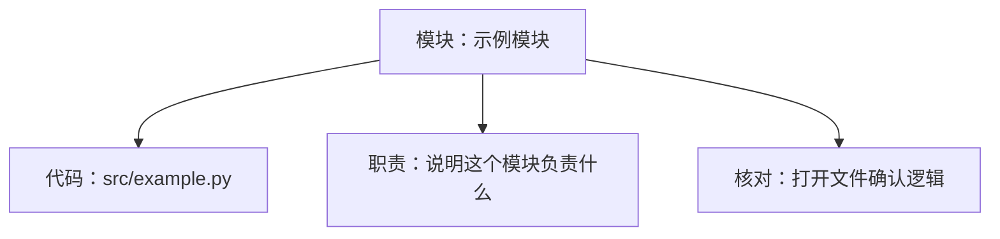
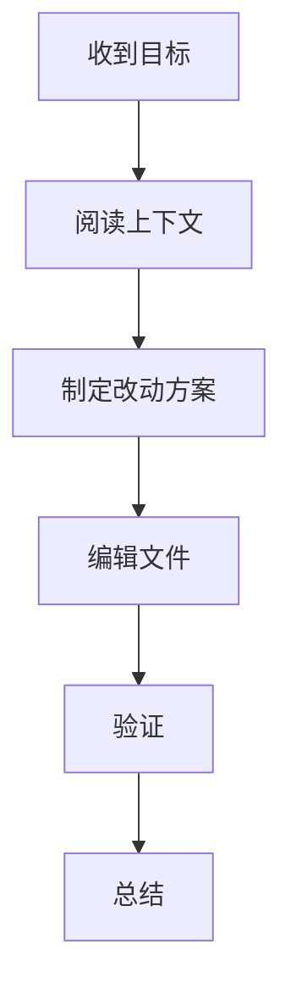

# Code CCTV

Use this skill to make programming work observable. Keep a Markdown file named `AI_WORKLOG.md` in the current workspace root unless the user names another file. Prefer the Chinese template by default.

When this skill is invoked or implicitly selected, treat the monitor as active for the whole coding task. The user should not need to keep reminding Codex to update the Markdown file.

## Required behavior

1. At the start of the task, create or refresh `AI_WORKLOG.md` with the current goal, status, information-pyramid summary, module map, and Mermaid flowcharts.
2. During work, update the file after every meaningful user interaction, code output, tool batch, file edit, validation run, blocker, changed assumption, or completion step. If the user asks for automated updates, update the file whenever there is interaction or code output, even if no source file changed.
3. Before producing a substantial code snippet, patch, command sequence, or implementation explanation to the user, record the intent in `AI_WORKLOG.md`; after the tool work or code output, record what actually happened and the evidence.
4. When using tools, update the file before the first user-visible tool work when feasible and after each meaningful tool batch. For long tasks, do not leave the Markdown stale while Codex continues working.
5. Use information-pyramid order throughout the Markdown: put the most important conclusion, risk, blocker, and next action first; then show module diagrams; then show workflow, live notes, files, functions, code sections, decisions, validation, and final details.
6. For code changes or code explanation tasks, fill the module table before the function and code-section tables. Each module should include its responsibility, related files/functions, dependencies, risks, and beginner-friendly verification.
7. Render a Mermaid module graph for code work. Each relevant module should appear as a graph node connected to its related code, responsibility, verification point, and risk or dependency when present.
8. For code changes or code explanation tasks, fill the function and code-section tables with file paths and line numbers. Explain what each function/section does in beginner-friendly Chinese.
9. Add beginner verification checks that tell the user exactly what to inspect, how to inspect it, and what result to expect.
10. Preserve visibility even when no code changes are made. Record analysis-only work, reviewed files, and conclusions.
11. End every monitored task by writing a final summary section with what changed, verification, residual risks, and next suggested action when useful.

Update triggers include:
   - starting context discovery
   - identifying the likely implementation path
   - replying to a user follow-up that changes or continues the coding task
   - outputting code, patches, commands, or implementation details
   - editing files
   - running validation
   - finding a blocker, risk, or changed assumption
   - finishing the task

Do not wait for a final summary to update the monitor. The point of this skill is that the Markdown changes while the coding work is happening.

## Markdown structure

Use these Chinese sections in this order:

````markdown
# Code CCTV

最后更新：YYYY-MM-DD HH:MM:SS CST
状态：侦察中 | 制定方案 | 修改中 | 验证中 | 阻塞 | 完成
当前关注：一句话说明我现在正在处理什么。

## 信息金字塔

| 优先级 | 先看什么 | 证据 / 下一步 |
| --- | --- | --- |

## 模块图谱

| 模块 | 相关代码 | 职责 | 依赖 | 风险 | 怎么核对 |
| --- | --- | --- | --- | --- | --- |



## 流程图



## 实时记录

| 时间 | 阶段 | 发生了什么 | 证据 |
| --- | --- | --- | --- |

## 涉及文件

| 文件 | 用途 | 状态 |
| --- | --- | --- |

## 函数定位

| 位置 | 函数 | 作用 | 怎么核对 |
| --- | --- | --- | --- |

## 代码片段说明

| 位置 | 代码片段 | 这段在做什么 | 初学者核对点 |
| --- | --- | --- | --- |

## 决策记录

| 决策 | 原因 | 取舍 |
| --- | --- | --- |

## 验证结果

| 检查 | 结果 | 备注 |
| --- | --- | --- |

## 初学者核对清单

| 要核对什么 | 怎么核对 | 预期结果 |
| --- | --- | --- |

## 风险与待确认

- 暂无。

## 最终总结

待完成。
````

Keep the Mermaid graph valid. Use quoted node labels and simple ASCII identifiers. Update the graph when the workflow branches, blocks, or skips a phase.

A reusable Chinese template is bundled at `assets/worklog-template.zh-CN.md`.

## Script

Use the bundled script when helpful:

```bash
python3 scripts/update_worklog.py --workspace "$PWD" --status "侦察中" --focus "正在阅读项目上下文" --note "已建立工作日志" --phase "开始" --evidence "用户要求监控"
```

Use `--language zh` explicitly when the user asks for Chinese, though Chinese is the script default:

```bash
python3 scripts/update_worklog.py --workspace "$PWD" --language zh --status "侦察中" --focus "正在阅读项目上下文" --phase "开始" --note "已建立中文监控文件" --evidence "用户要求中文模板"
```

The script is deterministic and can initialize the file, append live notes, record priority summaries, module maps, touched files, decisions, validation results, risks, and final summaries. It rewrites the monitored sections between stable markers, so it is safer than ad hoc Markdown editing for repeated updates. It can also parse old English headings and then re-render the monitor in Chinese.

Add information-pyramid rows and module diagrams with:

```bash
python3 scripts/update_worklog.py --workspace "$PWD" --language zh \
  --top "P0 先看结论|当前最重要的变化、风险或下一步|打开本节先判断是否阻塞" \
  --module "登录模块|src/auth.py:1-120|处理登录输入、校验和返回结果|配置模块|账号边界条件可能漏测|运行登录测试，并手动尝试错误密码"
```

Add beginner-facing code maps with:

```bash
python3 scripts/update_worklog.py --workspace "$PWD" --language zh --function "src/app.py:42|load_config|读取配置文件并返回字典|打开该行，确认调用处传入的路径存在，并运行相关测试" --segment "src/app.py:40-58|配置加载逻辑|把 JSON 文件读入内存，缺失时给默认值|改一个临时配置值，确认程序读取结果变化"
```

For Python, JavaScript, and TypeScript projects, generate a first-pass function skeleton with:

```bash
python3 scripts/scan_code_map.py src tests
```

Treat scanner output as a locator scaffold only. Replace the placeholder purpose and verification text with context-aware Chinese explanations before finalizing the worklog.

For disk-level automatic file-change notes, use the optional watcher:

```bash
python3 scripts/watch_worklog.py --workspace "$PWD"
```

Use one-shot mode when a task runner or external editor should trigger a single check:

```bash
python3 scripts/watch_worklog.py --workspace "$PWD" --once
```

The watcher records file creation, modification, and deletion into `AI_WORKLOG.md`. It does not read chat messages; interaction and code-output updates remain Codex's responsibility while this skill is active.

Before using the script, inspect `scripts/update_worklog.py` if behavior changes are needed. Otherwise it can be executed directly.

## Cadence

Update the monitor before user-visible tool work begins when feasible. For longer tasks, update it after every meaningful interaction or tool batch, and whenever a user would otherwise be left guessing what is happening.

Do not claim that the monitor is universal background telemetry. It is an explicit work protocol maintained by Codex during the task, plus an optional file watcher for disk changes.
