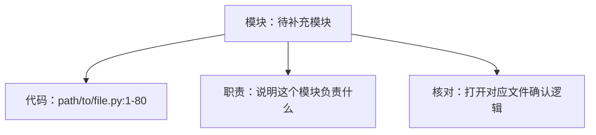
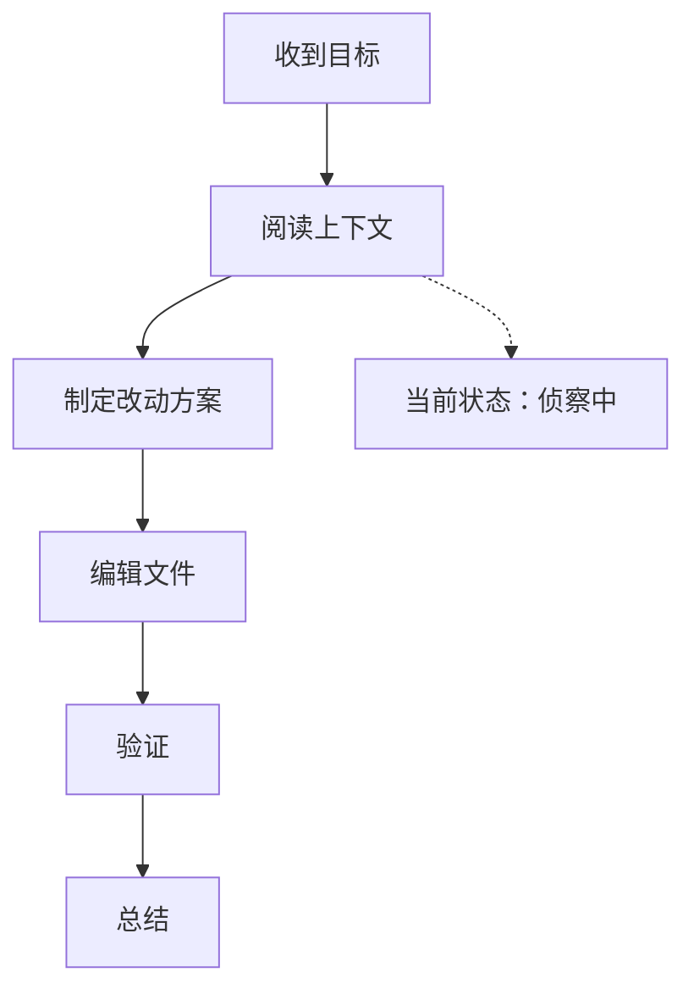

<!-- code-cctv:start -->
# Code CCTV

最后更新：YYYY-MM-DD HH:MM:SS CST
状态：侦察中 | 制定方案 | 修改中 | 验证中 | 阻塞 | 完成
当前关注：一句话说明我现在正在处理什么。

## 信息金字塔

| 优先级 | 先看什么 | 证据 / 下一步 |
| --- | --- | --- |
| P0 先看结论 | 当前最重要的状态、风险或完成结果。 | 打开本节即可先判断有没有阻塞、风险和下一步。 |
| P1 再看模块 | 这次涉及哪些代码模块，每个模块负责什么。 | 查看“模块图谱”，按模块跳到相关文件和函数。 |
| P2 最后查细节 | 实时记录、函数定位、代码片段说明和验证证据。 | 需要复盘时再往下逐条核对。 |

## 模块图谱

| 模块 | 相关代码 | 职责 | 依赖 | 风险 | 怎么核对 |
| --- | --- | --- | --- | --- | --- |
| 待补充模块 | path/to/file.py:1-80 | 用一句小白能懂的话说明这个模块负责什么。 | 暂无 | 暂无 | 打开对应文件，确认它和本次目标有关。 |

## 流程图

## 实时记录

| 时间 | 阶段 | 发生了什么 | 证据 |
| --- | --- | --- | --- |
| YYYY-MM-DD HH:MM:SS CST | 开始 | 已建立中文监控模板。 | 用户要求中文模板 |

## 涉及文件

| 文件 | 用途 | 状态 |
| --- | --- | --- |

## 函数定位

| 位置 | 函数 | 作用 | 怎么核对 |
| --- | --- | --- | --- |

## 代码片段说明

| 位置 | 代码片段 | 这段在做什么 | 初学者核对点 |
| --- | --- | --- | --- |

## 决策记录

| 决策 | 原因 | 取舍 |
| --- | --- | --- |

## 验证结果

| 检查 | 结果 | 备注 |
| --- | --- | --- |

## 初学者核对清单

| 要核对什么 | 怎么核对 | 预期结果 |
| --- | --- | --- |

## 风险与待确认

- 暂无。

## 最终总结

待完成。
<!-- code-cctv:end -->
